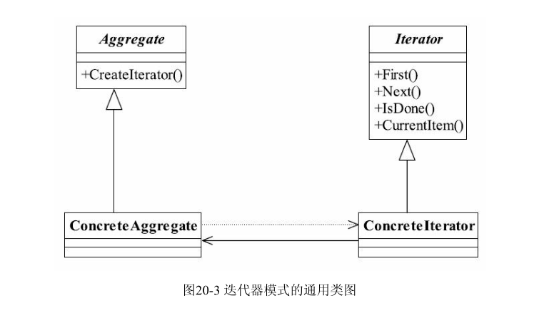

# 迭代器模式的定义
Provide a way to access the elements of an aggregate object sequentially without exposing its
underlying representation.（它提供一种方法访问一个容器对象中各个元素，而又不需暴露该
对象的内部细节。）

迭代器是为容器服务的，那什么是容器呢？ 能容纳对象的所有类型都可以称之为容
器，例如Collection集合类型、Set类型等，迭代器模式就是为解决遍历这些容器中的元素而
诞生的。其通用类图，如图20-3所示。

* Iterator抽象迭代器

    抽象迭代器负责定义访问和遍历元素的接口，而且基本上是有固定的3个方法：first()获
    得第一个元素，next()访问下一个元素，isDone()是否已经访问到底部（Java叫做hasNext()方
    法）。
    
* ConcreteIterator具体迭代器

    具体迭代器角色要实现迭代器接口，完成容器元素的遍历。
  
* Aggregate抽象容器

    容器角色负责提供创建具体迭代器角色的接口，必然提供一个类似createIterator()这样的
    方法，在Java中一般是iterator()方法。
    
* Concrete Aggregate具体容器

    具体容器实现容器接口定义的方法，创建出容纳迭代器的对象。