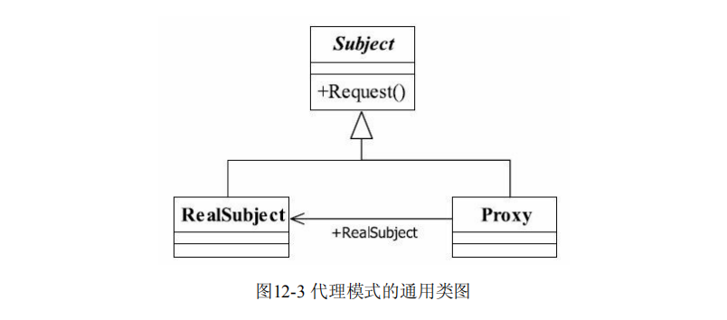

# 代理模式（Proxy Pattern）
> Provide a surrogate or placeholder for another object to control access to it.（为其他对象提供
  一种代理以控制对这个对象的访问。）

# 通用类图


## 动态代理

## 通用类图


### Spring AOP动态代理主要有两种方式，JDK动态代理和CGLIB动态代理。
```
JDK动态代理通过反射来接收被代理的类，并且要求被代理的类必须实现一个接口。
JDK动态代理的核心是InvocationHandler接口和Proxy类。

如果目标类没有实现接口，那么Spring AOP会选择使用CGLIB来动态代理目标类。
CGLIB（Code Generation Library），是一个代码生成的类库，可以在运行时动态的生成某个类的子类（通过修改字节码来实现代理）。
注意，CGLIB是通过继承的方式做的动态代理，因此如果某个类被标记为final，那么它是无法使用CGLIB做动态代理的。
jdk和cglib动态代理来共同实现我们的aop面向切面的功能。

各自局限：

1、JDK的动态代理机制只能代理实现了接口的类，而不能实现接口的类就不能实现JDK的动态代理。

2、cglib是针对类来实现代理的，他的原理是对指定的目标类生成一个子类，并覆盖其中方法实现增强，但因为采用的是继承，所以不能对final修饰的类进行代理。
```
